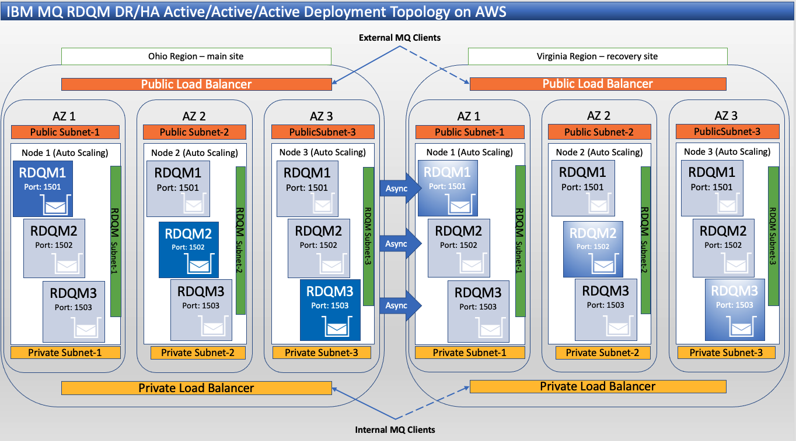
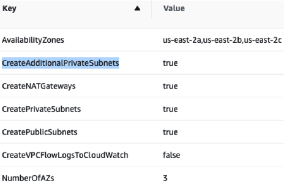
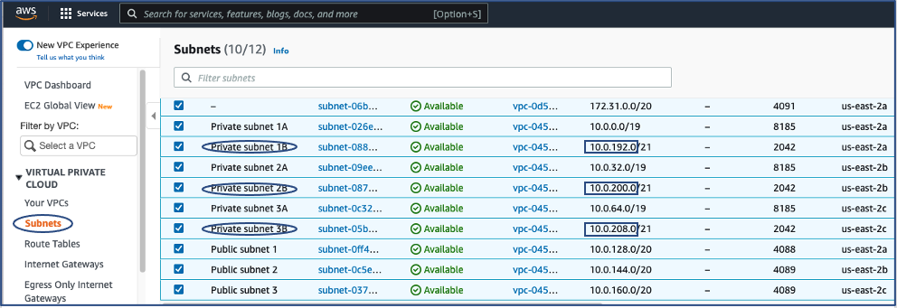
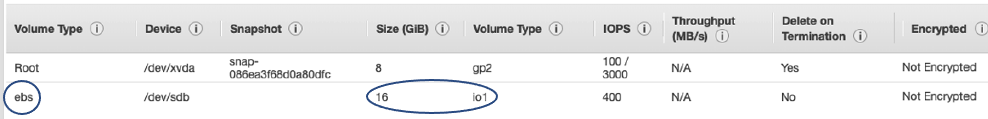
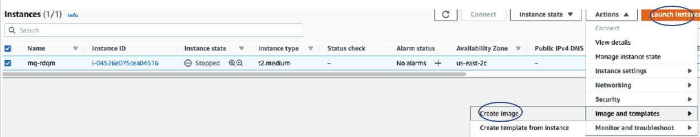
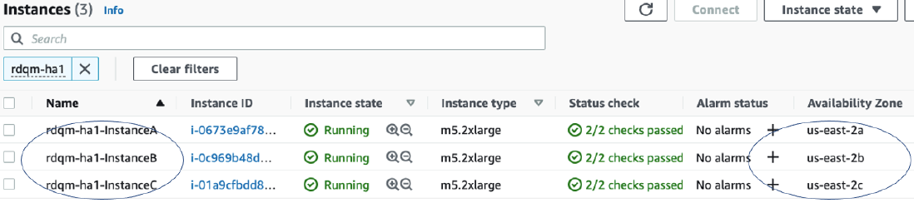
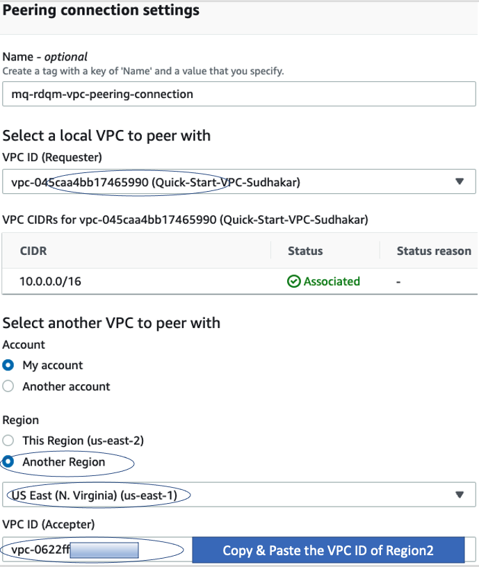
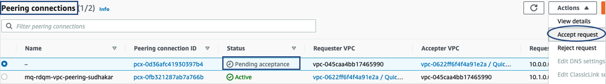
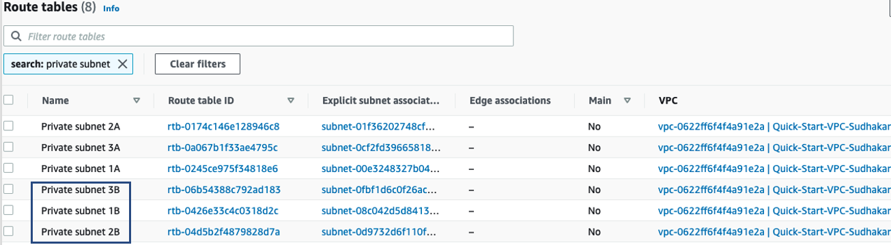
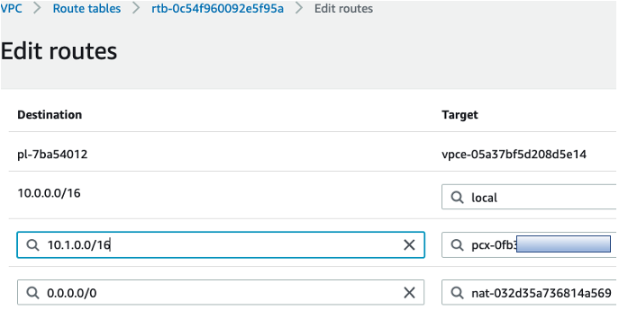

# Deploying IBM(R) MQ Advanced RDQM DR/HA on AWS

This version of the sample shows how to deploy the Replicated Data Queue Manager Disaster Recovery High Availability (RDQM DR/HA) Queue Manager in two AWS regiions.

1. It uses an AutoScalingGroup with a LaunchConfiguration in each Availability Zone to automate the creation of each instance, including replacing an instance automatically if one fails
2. It uses a separate NetworkInterface for each Instance that is dedicated to RDQM
3. It creates two LoadBalancers: one for public traffic and one for private traffic

As three Instances have to be created in each region you will probably want to create your own AMI so that you can do most of the configuration, including installing MQ, only once.

Administration and configuration of RDQM is easiest if the mqm user has some specific sudo privileges and can ssh between the three instances without a password.

The description of creating the AMI below includes setting up the sudo access. Setting up the passwordless ssh is done once the instances have been created.

Deployment Topolology diagram below:



## Creating a new VPC in Ohio Region
Login to AWS Console, navigate to Services > Management & Governance > Cloudformation > Stacks Create Stack > With New Resources (Standard). Paste https://aws-quickstart.s3.amazonaws.com/quickstart-aws-vpc/templates/aws-vpc.template.yaml for "AWS S3 Url" field.

Check you have the correct Region selected.

The RDQM sample deployment requires 3 Public Subnets, and 6 Private Subnets.

Select 3 Availability Zones, and check CreateAdditionalPrivateSubnets option as below. If the stack completed successfully it should create 3-Public Subnets, and 6-Private Subnets. The 3-Public Subnets will be used by the Public Load Balancer, and 3-Private Subnets will be used by the Private Load Balancer, and remaining 3-Private Subnets will be used by RDQM for MQ replication (see the topology diagram).




## Creating a new VPC in Virginia Region
Create a VPC same as above, but change the CIDR to 10.1.0.0/16.


## Capture VPC, Subnet, PrivateNetwork(B) IP Addresses of both Regions
Capture the vpc-id, subnet-ids (both public and private - total 9). I will preset these ID's in rdqm.template.yaml, and rdqm.template.yaml.

Capture CIDR IP address of PrivateNetwork 1B, 2B, 3B. I will be preset these IP addresses in setupRDQMInstance script.



## Update ohio/rdqm.template.yaml, ohio/setupRDQMInstance

Clone this github repo into your computer, and modify the files.

### ohio/rdqm.template.yaml
Edit and populate the default values.

Parameters:
```
VpcId : Default: <vpc-id-value-captured-above>
PrivateSubnetA : Default: <Private subnet 1A-value-captured-above>
RdqmPrivateSubnetA : Default: <Private subnet 1B-value-captured-above>
RdqmAddressA : Default: <Private subnet 1B's IPv4 CIDR -10.0.192.<nn>> # Note: If PrivateSubnet1B contains10.0.128.0 then RdqmAddressA should follow CIDR 10.0.192.<nn> ex: 10.0.192.25 #

Similarly polulate the below;
PrivateSubnetB : Default: <Private subnet 2A-ID value-captured-above>
RdqmPrivateSubnetB : Default: <Private subnet 2B-value-captured-above>
RdqmAddressB : Default: <Private subnet 2B - IPv4 CIDR -10.0.200.<nn>>

PrivateSubnetC : Default: <Private subnet 3A-value-captured-above>
RdqmPrivateSubnetC : Default: <Private subnet 3B- id value-captured-above>
RdqmAddressC: Default: <Private subnet 3B - IPv4 CIDR -10.0.208.<nn>>
```

### ohio/setupRDQMInstance
Edit and populate IP addresses under configureNetworkForA, configureNetworkForB, configureNetworkForC functions.

```
configureNetworkForA
IPADDR=10.0.192.25                  # RdqmAddressA configured above in rdqm.template.yaml #
10.0.200.25 via 10.0.192.1 dev eth1 # Where, 10.0.200.25 is
RdqmAddressB above, 10.0.192.1 is "Private Subnet 1B IpV4CIDR + 1. Ex: 10.0.192.0 will be 10.0.192.1) #
10.0.208.25 via 10.0.192.1 dev eth1 # Where, 10.0.208.25 is RdqmAddressB above #
10.1.192.25 via 10.0.192.1 dev eth1  (DR RDQM IP NODE1)
10.1.200.25 via 10.0.192.1 dev eth1  (DR RDQM IP NODE2)
10.1.208.25 via 10.0.192.1 dev eth1  (DR RDQM IP NODE3)

Similarly, configure other functions.

configureNetworkForB
IPADDR=10.0.200.25
10.0.192.25 via 10.0.200.1 dev eth1
10.0.208.25 via 10.0.200.1 dev eth1
10.1.192.25 via 10.0.200.1 dev eth1
10.1.200.25 via 10.0.200.1 dev eth1
10.1.208.25 via 10.0.200.1 dev eth1

configureNetworkForC
IPADDR=10.0.208.25
10.0.192.25 via 10.0.208.1 dev eth1
10.0.200.25 via 10.0.208.1 dev eth1
10.1.192.25 via 10.0.208.1 dev eth1
10.1.200.25 via 10.0.208.1 dev eth1
10.1.208.25 via 10.0.208.1 dev eth1

The scripts will be placed in RHEL AMI Image Virtual machine under /root/bin folder.
```


## Update virginia/rdqm.template.yaml, virginia/setupRDQMInstance
Same as above, update IP Addresses but use 10.1.x.x instead of 10.0.x.x.


## Ohio - Create keypair
Navigate to Services > Compute > Network & Security > Key Pairs > Create Key pair. This key will be used by the bastion virtual machine, and the 3-RDQM RedHat virtual machines.


## Virginia - Create keypair
Same as above.


## Ohio - Create Bastion VM
The Bastion Virtual Machine will be in the Public Subnet of your VPC. I will be logging into my RDQM virtual machines through the Bastion since my RDQM VM's are inside the Private Subnet.

From the AWS Console, navigate to EC2 > Instances > Launch Instances > Select Ubuntu Server 20.04 LTS > Review andLaunch.

Select Instance Details, select the VPC created above, and select Public Subnet 1.

You can create multiple Bastion VM's to host in another Public Subnet. For this sample, I created one Bastion VM only.

Create new security group or use an existing one. I selected the keypair that I created earlier.

## Virginia - Create Bastion VM
Same as above.


## Ohio - Create RedHat Linux VM

I will be installing IBM MQ on this server, and then I will use this VM to create the AMI.

When choosing an instance type for your instances the two main factors as far as the performance of RDQM are concerned are the storage performance and the network performance. I suggest that you find an instance type and storage type that supports your desired workload without RDQM and then experiment with the various networking options to find one that allows for the performance you need when RDQM is used.

I chose a size of 16GB for the initial storage volume.

RDQM requires a volume group named drbdpool so I am going to add a second volume to the AMI to support that. Note that when you create an instance of your AMI the size of the second volume has to be at least as large as the volume used in the AMI. I used an `Amazon EBS Provisioned IOPS SSD (io1)` volume.

From the AWS Console, navigate to EC2 > Instances > Launch Instances > Select Red Hat Linux > Review andLaunch.
Open Additional Details section,
```
Select your-vpc, a Public or Private Subnet.
```
Additional Storage section, add extra storage like below:


## Download IBM MQ Developer version

The 90-day trial version can be downloaded from [link] (https://ibm-cloud.slack.com/archives/C3QKGL8KV/p1625488377312700). 

Transfer mqadv_dev925_linux_x86-64.gz, setupRDQMInstance, configureRdqm files to RHEL VM.

Ohio - RHEL VM
``` 
sftp -i "rdqm-.pem" ec2-user@ec2-xx-xxx-xx-xx.us-east-2.compute.amazonaws.com
sftp> put mqadv_dev925_linux_x86-64.gz
sftp> put ohio/setupRdqmInstance
sftp> put ohio/configureRdqm
```

Virginia - RHEL VM
``` 
sftp -i "rdqm-virginia.pem" ec2-user@ec2-xx-xxx-xx-xx.us-east-2.compute.amazonaws.com
sftp> put mqadv_dev925_linux_x86-64.gz
sftp> put virginia/setupRdqmInstance
sftp> put virginia/configureRdqm
```

## Virginia - Create RedHat Linux VM
Same as above.


## Ohio - RedHat Linux VM Configuration & Installing MQ

ssh into the RedHat Linux VM that I created above.

Move the scripts to /root/bin
```
sudo -s
chmod +x setupRdqmInstance configureRdqm
chown root:root setupRdqmInstance configureRdqm
mkdir /root/bin
mv setupRdqmInstance configureRdqm /root/bin
```

### Linux Kernel Configuration

There are some changes that should be made to avoid MQ producing a warning when it is installed.

There is also one additional package that needs to be installed before installing MQ.

I ran the following:
```
sudo -s
yum install -y bc
echo 'kernel.shmmax=268435456' >> /etc/sysctl.conf
echo 'vm.overcommit_memory=2' >> /etc/sysctl.conf
sysctl -p
echo 'fs.file-max=524288' >> /etc/sysctl.conf
echo 32768 > /proc/sys/kernel/threads-max
echo '* hard nofile 10240' >> /etc/security/limits.conf
echo '* soft nofile 10240' >> /etc/security/limits.conf
echo 'root hard nofile 10240' >> /etc/security/limits.conf
echo 'root soft nofile 10240' >> /etc/security/limits.conf
sysctl -p
```

### Initialize secondary storage, create drbdpool volume group 
```
yum install lvm2 # contains pvcreate commands
vgcreate drbdpool /dev/xvdb
pvs
vgs
exit
sudo -i
```

### Installing IBM MQ

I installed the Trial version of IBM MQ Advanced 9.2.0 for Linux. If you have spare licenses you could install the IBM MQ Advanced product. 

I created a directory /root/MQ and copied the file `IBM_MQ_9.2.0_LINUX_X86-64_TRIAL.tar.gz` to it. I then ran the following:
```
cd MQ
tar -xvzf IBM_MQ_9.2.0_LINUX_X86-64_TRIAL.tar.gz
cd MQServer
./mqlicense.sh -accept
-- Identify the right kmod version: Output will be like: kmod-drbd-9.1.5_4.18.0_305-1.x86_64.rpm
Advanced/RDQM/PreReqs/el8/kmod*/modver
-- Note: if you get "Unsupported kernel release" then download correct kmod package based on  your RHEL OS version "https://www.ibm.com/support/pages/ibm-mq-replicated-data-queue-manager-kernel-modules". Download the correct module and upload to PreReqs/el8 folder.
-- Install kmod package
yum install -y Advanced/RDQM/PreReqs/el8/<output of modver command>
-- Install drbd package
yum install -y Advanced/RDQM/PreReqs/el8/drbd-utils-9/*
yum install -y Advanced/RDQM/PreReqs/el8/pacemaker-2/*
yum install -y MQSeriesGSKit* MQSeriesServer* MQSeriesRuntime* MQSeriesSamples* MQSeriesClient*
yum install -y Advanced/RDQM/MQSeriesRDQM*
yum install -y unzip
cd /opt/mqm/bin 
./mqlicense -accept
/opt/mqm/bin/setmqinst -i -p /opt/mqm

usermod -a -G haclient,mqm ec2-user
```

I then added the following line to /home/ec2-user/.bash_profile:

```
. /opt/mqm/bin/setmqenv -s
set -o vi
```

I logged out completely and logged back in again as ec2-user.

I ran mqconfig which reported PASS for everything.

I ran `dspmqver` which produced:

```
Name:        IBM MQ
Version:     9.2.0.0
Level:       p920-L200710.TRIAL
BuildType:   IKAP - (Production)
Platform:    IBM MQ for Linux (x86-64 platform)
Mode:        64-bit
O/S:         Linux 4.18.0-305.el8.x86_64
O/S Details: Red Hat Enterprise Linux 8.4 (Ootpa)
InstName:    Installation1
InstDesc:
Primary:     Yes
InstPath:    /opt/mqm
DataPath:    /var/mqm
MaxCmdLevel: 920
LicenseType: Trial
```

### Granting sudo access

To grant the required sudo access to the mqm user, as root I created a file `/etc/sudoers.d/mqm` containing:

```
mqm ALL=(root) NOPASSWD: /opt/mqm/bin/crtmqm, /opt/mqm/bin/dltmqm, /opt/mqm/bin/rdqmadm, /opt/mqm/bin/rdqmstatus
```

### Configuring SELinux for DRBD

If you plan to run SELInux in your instances you need to run `semanage permissive -a drbd_t` as root.
```
yum install -y policycoreutils-python-utils
semanage permissive -a drbd_t
```
OR you can update global setting like below,
```
vi /etc/selinux/confi g
SELINUX=permissive
```

## Virginia - RedHat Linux VM Configuration & Installing MQ
Same as above.


## Ohio - Creating the Amazon Machine Image (AMI)

I stop my Instance before creating the AMI so I exited and stopped the Instance in the AWS Console. Navigate to AWS Console > Instances > Select RHEL VM > STOP theinstance.

Create AMI image, navigate to AWS Console > Instances > Select RHEL VM > Actions > imageand template > Create Image.


Check the AMI image status, and note down the AMI ID. This ami-id will be populated in Cloudformation rdqm.template.yaml file.


## Virginia - Creating the Amazon Machine Image (AMI)
Same as above.


## Ohio - Deploy the template

When you deploy the template you will be prompted for a lot of information, including the AMI to use where you should specify the ID of the AMI you created.

I suggest you update the defaults (already updated above) in your copy of the template to avoid having to enter the same information each time you try deploying the template.

Deploy the modifi ed template (rdqm.template.yaml). Navigte to AWS Console > Cloudformation > Create Stack > With newResources (standard) > Upload a template file > browse to rdqm.template.yaml.

Populate the keypair, ami-id that captured above.

Finish creating the Cloudformation template. Make sure the Cloudformation Stack is completed successfully. If successful you should see the new 3 Virtual Machines created for RDQM.



## Virginia - Deploy the template
Same as above.


## Create AWS Peering Connection

I created VPC Peering Connection between Ohio and Virginia, and updated RDQM Routing tables on both sides (see below steps).

### Create peering connection in Ohio Region


### Check peering connection in Virginia Region
Switch to the Virginia region, check for the Pending Acceptance peering connection, and Accept Request.



## Edit Routing Tables
### Ohio Region

Edit Routing tables of "Private Subnet 1B, 2B, 3B", and add VPC CIDR of the second region as below. 
Start with Ohio Region first.




### Virginia Region

Repeat the same steps on Virginia Region.


## Ohio - Create an RDQM DR/HA Queue Manager

Open 3 terminals, and ssh into the Bastion server.
ssh into RDQM vm1 from Bastion Terminal 1. Similarly ssh into RDQM vm2, and RDQM vm3.

Create 3 Queue Managers, one from each Terminal.


Ohio Region
```
Node-3
crtmqm -sxs -rr p -rl 10.0.192.25,10.0.200.25,10.0.208.25 -ri 10.1.192.25,10.1.200.25,10.1.208.25 -rp 7004 -fs 3072M DRHAQM1
There are 87 days left in the trial period for this copy of IBM MQ.
Creating replicated data queue manager configuration.
IBM MQ secondary queue manager created.

Node-2
crtmqm -sxs -rr p -rl 10.0.192.25,10.0.200.25,10.0.208.25 -ri 10.1.192.25,10.1.200.25,10.1.208.25 -rp 7004 -fs 3072M DRHAQM1
There are 87 days left in the trial period for this copy of IBM MQ.
Creating replicated data queue manager configuration.
IBM MQ secondary queue manager created.

Node-1
crtmqm -sx -rr p -rl 10.0.192.25,10.0.200.25,10.0.208.25 -ri 10.1.192.25,10.1.200.25,10.1.208.25 -rp 7004 -fs 3072M DRHAQM1
There are 87 days left in the trial period for this copy of IBM MQ.
Creating replicated data queue manager configuration.
IBM MQ queue manager created.
Directory '/var/mqm/vols/drhaqm1/qmgr/drhaqm1' created.
The queue manager is associated with installation 'Installation1'.
Creating or replacing default objects for queue manager 'DRHAQM1'.
Default objects statistics : 83 created. 0 replaced. 0 failed.
Completing setup.
Setup completed.
Enabling replicated data queue manager.
Replicated data queue manager enabled.
Issue the following command on the remote HA group to create the DR/HA
secondary queue manager:
crtmqm -sx -rr s -rl 10.1.192.25,10.1.200.25,10.1.208.25 -ri 10.0.192.25,10.0.200.25,10.0.208.25 -rp 7004 -fs 3072M DRHAQM1
```

Virginia Region
```
Node-3
crtmqm -sxs -rr s -rl 10.1.192.25,10.1.200.25,10.1.208.25 -ri 10.0.192.25,10.0.200.25,10.0.208.25 -rp 7004 -fs 3072M DRHAQM1
There are 89 days left in the trial period for this copy of IBM MQ.
Creating replicated data queue manager configuration.
IBM MQ secondary queue manager created.

Node-2
crtmqm -sxs -rr s -rl 10.1.192.25,10.1.200.25,10.1.208.25 -ri 10.0.192.25,10.0.200.25,10.0.208.25 -rp 7004 -fs 3072M DRHAQM1
There are 89 days left in the trial period for this copy of IBM MQ.
Creating replicated data queue manager configuration.
IBM MQ secondary queue manager created.

Node-1
crtmqm -sx -rr s -rl 10.1.192.25,10.1.200.25,10.1.208.25 -ri 10.0.192.25,10.0.200.25,10.0.208.25 -rp 7004 -fs 3072M DRHAQM1
There are 89 days left in the trial period for this copy of IBM MQ.
Creating replicated data queue manager configuration.
IBM MQ secondary queue manager created.
Enabling replicated data queue manager.
Replicated data queue manager enabled.
```

Similary, if you want to to create DRHAQM2 (node2's), DRHAQM3 (node3's).

If you check on the status of the RDQM with the command `rdqmstatus -m DRHAQM1` you should see something like:

Ohio
```
rdqmstatus -m DRHAQM1
Node:                                   InstanceA
Queue manager status:                   Running
CPU:                                    0.00%
Memory:                                 179MB
Queue manager file system:              58MB used, 2.9GB allocated [2%]
HA role:                                Primary
HA status:                              Normal
HA control:                             Enabled
HA current location:                    This node
HA preferred location:                  This node
HA floating IP interface:               None
HA floating IP address:                 None
DR role:                                Primary
DR status:                              Normal
DR port:                                7002
DR local IP address:                    10.0.192.25
DR remote IP address list:              10.1.192.25,10.1.200.25,10.1.208.25
DR current remote IP address:           10.1.192.25

Node:                                   InstanceB
HA status:                              Normal

Node:                                   InstanceC
HA status:                              Normal
```

Virginia
```
rdqmstatus -m DRHAQM1
Node:                                   InstanceA
Queue manager status:                   Ended immediately
HA role:                                Primary
HA status:                              Normal
HA control:                             Disabled
HA current location:                    This node
HA preferred location:                  This node
HA floating IP interface:               None
HA floating IP address:                 None
DR role:                                Secondary
DR status:                              Normal
DR port:                                7002
DR local IP address:                    10.1.192.25
DR remote IP address list:              10.0.192.25,10.0.200.25,10.0.208.25
DR current remote IP address:           10.0.192.25

Node:                                   InstanceB
HA status:                              Normal

Node:                                   InstanceC
HA status:                              Normal
```

Congratulations, you have got a running RDQM DR/HA Queue Manager in two AWS Regions.

### Configure Queue Manager
```
runmqsc DRHAQM1
ALTER QMGR CHLAUTH(DISABLED)
ALTER QMGR CONNAUTH(' ')
REFRESH SECURITY (*)
DEFINE CHANNEL(RDQM.SVRCONN) CHLTYPE(SVRCONN)
DEFINE QLOCAL(TEST.IN)
```


## Testing

The sample client programs passes your login userid through MQCSP structure to the Queue Manager. So, you need to create an ID in RDQM vm1, vm2, vm3. 

Create userid in Ohio vm1, vm2, vm3.
```
sudo -s
adduser johnc
usermod -a -G mqm sbodapati
```

I will use the PublicListenerLoadBalancer DNS address to test from my computer. You can use also the PrivateListenerLoadBalancer to test from the Bastion Server.

I will be using amqsphac mq ha client program to test the connectivity to RDQM1.


I have installed MQ Toolkit for Mac on my computer, which comes with IBM MQ Sample client programs. You can download MQ Toolkit for mac from [here](https://developer.ibm.com/tutorials/mq-macos-dev/).

```
export MQSERVER="RDQM.SVRCONN/TCP/PublicListenerLoadBalancer-xxxxx.elb.us-east-2.amazonaws.com(1501)"
$ amqsphac TEST.IN DRHAQM1
MacBook-Pro-2:~ myuserid$ amqsphac TEST.IN DRHAQM1
Sample AMQSPHAC start
target queue is TEST.IN
message <Message 1>
message <Message 2>
```

You can also use rfhutilc, mqexplorer, or msgmanager tools to verify connections to the Queue Manager RDQM1.

Download msgmanger from [here](https://community.ibm.com/community/user/integration/viewdocument/mq-message-manager-update?CommunityKey=d974a63b-37b1-4759-8c62-a9d4a6f71297).


Congratulations, you have successfully deployed IBM MQ RDQM HA Active/Active/Active topology in AWS!
